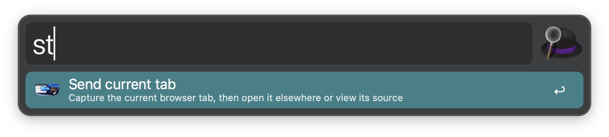
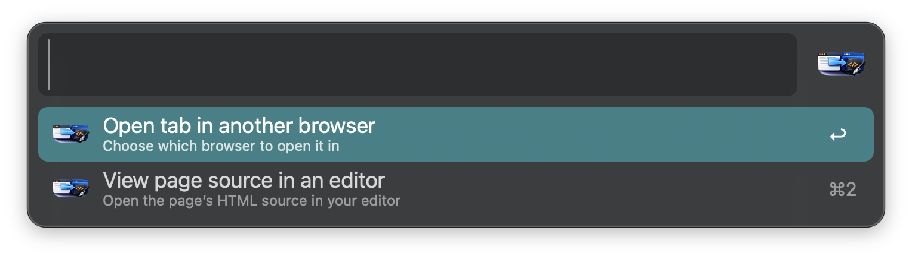
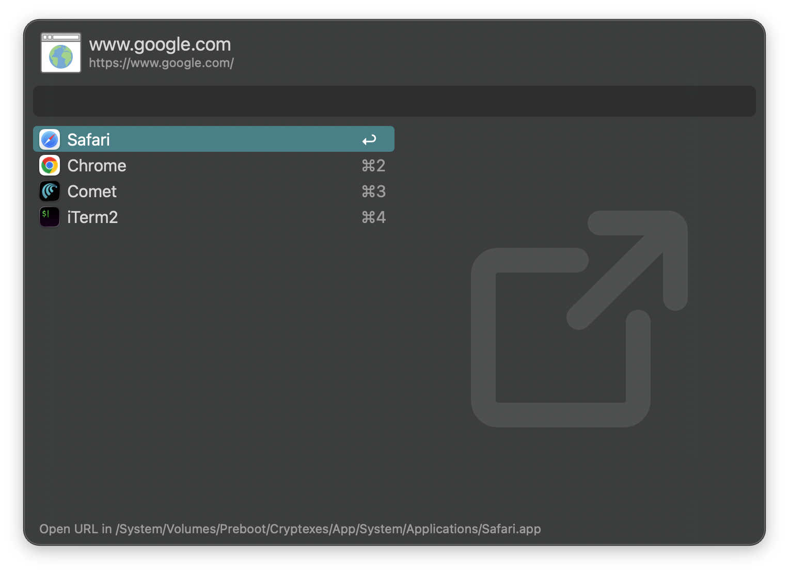

# Send Tab

## Usage

Capture the current browser tab via the `st` keyword.

Choose what to do with it:

* <kbd>↩︎</kbd> Open tab in another browser — hands off to Alfred's native "Open URL in…" panel, listing every browser you have installed.
* <kbd>⌘2</kbd> View page source in an editor — fetches the page's HTML and opens it in your preferred editor.

Opening in another browser shows Alfred's own panel, listing whatever's actually installed — nothing here is hardcoded, so it picks up browsers this workflow has never heard of.

Works out of the box with Safari and any Chromium-based browser (Chrome, Edge, Opera, Brave, Vivaldi, Arc, ...). Firefox and other browsers without an AppleScript dictionary are supported too, via a Cmd+L / Cmd+C fallback.

## Configuration

Change the keyword (default `st`) or your preferred editor (default Visual Studio Code) from the Workflow's Configuration.

## Notes

Viewing page source uses `curl`, so it won't carry your browser session — a page that requires login will show its login wall rather than your logged-in content.
